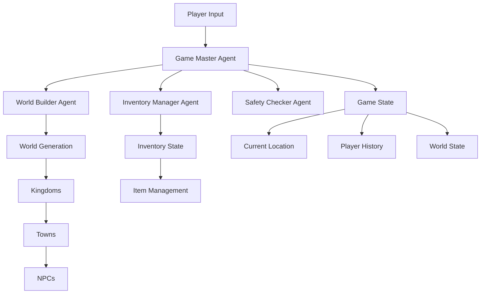

# Fantasy RPG Game with CrewAI Agents 🎮

A text-based RPG game that uses CrewAI agents and Together AI to create dynamic, interactive fantasy worlds. The game features hierarchical content generation, state management, and an immersive chat interface.

## System Architecture



## CrewAI Agent Framework 🤖

The game uses four main agents that work together:

1. **World Builder Agent**
```python
class WorldBuilderAgent:
    def __init__(self, api_key):
        self.agent = Agent(
            role='World Builder',
            goal='Create rich fantasy worlds',
            backstory='Expert at worldbuilding',
            allow_delegation=False,
            llm=CustomTogetherModel(api_key)
        )
```

2. **Game Master Agent**
```python
class GameMasterAgent:
    def __init__(self, api_key):
        self.agent = Agent(
            role='Game Master',
            goal='Manage game flow',
            backstory='Expert storyteller',
            allow_delegation=True,
            llm=CustomTogetherModel(api_key)
        )
```

Agent interaction flow:
```
Player Input -> Game Master -> World Builder -> Game State Update
                    ↓
              Safety Checker
                    ↓
             Inventory Manager
```

## Game State Management 🎲

Game state is managed through a Pydantic model:
```python
class GameState(BaseModel):
    world: Dict
    current_location: Dict
    inventory: Dict[str, int]
    history: List[Dict]
```

State components:
- World: Contains all generated content
- Location: Player's current position
- Inventory: Player's items
- History: Action/response log

## Hierarchical Content Generation 🏰

Content is generated in layers:

1. **World Generation**
```
World
  ├── Description
  └── Start Message
```

2. **Kingdom Generation**
```
Kingdom
  ├── Name
  ├── Description
  └── Unique Features
```

3. **Town Generation**
```
Town
  ├── Name
  ├── Description
  ├── Location Details 
  └── Points of Interest
```

4. **NPC Generation**
```
NPC
  ├── Name
  ├── Description
  ├── Background
  └── Motivations
```

## Getting Started 🚀

1. Install requirements:
```bash
pip install -r requirements.txt
```

2. Set up environment:
```bash
# .env file
TOGETHER_API_KEY=your_api_key_here
```

3. Initialize world:
```bash
python create_world.py
```

4. Run the game:
```bash
python main.py
```

## Key Features ✨

1. **Dynamic World Generation**
   - Procedurally generated content
   - Consistent world logic
   - Rich NPC interactions

2. **Inventory System**
   - Item management
   - Drag-and-drop interface
   - Real-time updates

3. **State Management**
   - Persistent game state
   - History tracking
   - Save/load functionality

4. **Safety Checks**
   - Content filtering
   - Input validation
   - Error handling

## Content Generation Example 🎨

```python
# Generate a new kingdom
kingdom = world_builder.generate_kingdoms(world_data)

# Generate towns for the kingdom
towns = world_builder.generate_towns(world_data, kingdom)

# Generate NPCs for each town
npcs = world_builder.generate_npcs(world_data, kingdom, town)
```

## Advanced Features 🔧

1. **Custom Together AI Integration**
```python
class CustomTogetherModel(BaseChatModel):
    def _generate(self, messages: List[Dict[str, Any]], stop: List[str] | None = None) -> str:
        response = self.client.chat.completions.create(
            model="meta-llama/Llama-3-70b-chat-hf",
            messages=messages
        )
        return response.choices[0].message.content
```

2. **Inventory Management**
```python
def update_inventory(self, item_updates):
    for update in item_updates:
        name = update['name']
        change = update['change_amount']
        
        if name not in self.inventory:
            self.inventory[name] = 0
        self.inventory[name] += change
```

3. **Event Logging**
```python
logging.info(f"Action processed: {action}")
logging.info(f"Current inventory: {game_state.inventory}")
```

## License 📄

MIT License - feel free to use and modify for your own projects!